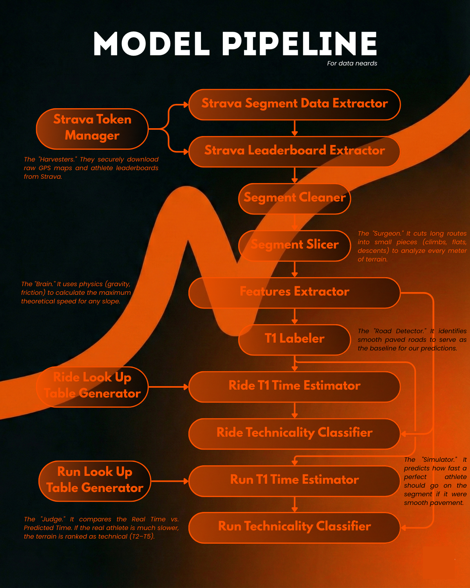

# Trail-Technicality-Classifier

**Classifies trail technicality (1-5) using Strava segment data.**

### Why?
- Help cyclists/runners pick trails matching their skill level or avoid trails that are too difficult
- Personal project to practice ML and data engineering

---

### Technicality Scale

| Score | Surface Type       | Description                     |
|-------|--------------------|---------------------------------|
| 1     | Road               | Smooth asphalt                  |
| 2     | Gravel             | Compact dirt                    |
| 3     | Mixed Terrain      | Roots & rocks                   |
| 4     | Technical          | Hard to navigate                |
| 5     | Extreme            | Unrideable sections             |
---

### Repository Structure

````bash
Trail-Technicality-Classifier/
├── data/
│   ├── old/                # Old datasets
│   ├── processed/          # Cleaned datasets (e.g., segments_manually_labeled.csv)
│   └── raw/                # Original Strava data (ignored by Git)
├── notebooks/              # First explorations
└── src/
    ├── data/               # Data loading scripts
    ├── debug/              # Debugging scripts
    ├── lookup_tables/      # Lookup tables
    └── models/             # ML code
````

### Setup 
1. Add Strava API keys to config.yaml (see .gitignore).
2. Install `requirements.txt`

### Model Pipeline Diagram
